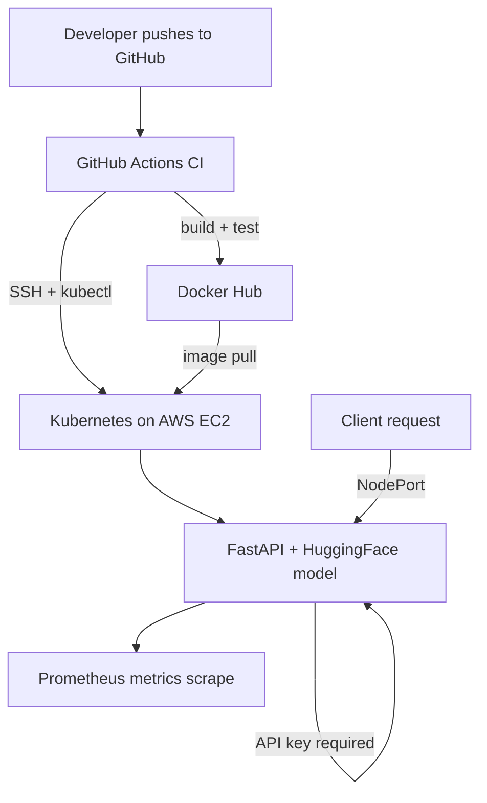

# AI Inference Platform

A containerized sentiment-analysis API, deployed on a self-provisioned Kubernetes cluster on AWS, with authentication, monitoring, and a full CI/CD pipeline — built end-to-end from scratch.

## Architecture



**Flow:** every push to `main` triggers GitHub Actions to build the image, run a smoke test, push it to Docker Hub, then SSH into a live AWS EC2 instance and trigger a Kubernetes rollout — fully automated, no manual deployment steps.

## What this demonstrates

| Area | Implementation |
|---|---|
| **Containers** | Multi-stage-aware Dockerfile, layer-cached builds, published to Docker Hub |
| **Kubernetes** | Deployment, Service (NodePort), Secret-based config injection, liveness probes |
| **Infrastructure as Code** | Full AWS provisioning (EC2, security group, key pair) via Terraform |
| **CI/CD** | GitHub Actions: build → test → push → deploy, gated on tests passing |
| **Auth** | API key middleware, secrets never committed to git |
| **Monitoring** | Prometheus scraping live app metrics (`/metrics`), memory-limited |
| **Networking** | Security groups, NodePort routing, DNS-based service discovery |

## Stack

- **App:** FastAPI, HuggingFace Transformers (DistilBERT sentiment analysis), PyTorch (CPU)
- **Containers:** Docker
- **Orchestration:** k3s (lightweight Kubernetes)
- **Infra:** Terraform, AWS EC2
- **CI/CD:** GitHub Actions
- **Registry:** Docker Hub
- **Monitoring:** Prometheus

## API

- `GET /health` — liveness check, no auth required
- `GET /metrics` — Prometheus-format metrics, no auth required
- `POST /predict` — sentiment prediction, requires `X-API-Key` header

```bash
curl -X POST http://<host>:30080/predict \
  -H "Content-Type: application/json" \
  -H "X-API-Key: <key>" \
  -d '{"text": "This project actually works end to end"}'

# {"label":"POSITIVE","confidence":0.97}
```

## Running it yourself

```bash
# 1. Provision infrastructure
cd infra && terraform init && terraform apply

# 2. SSH in, install k3s
ssh -i <key> ubuntu@<instance-ip>
curl -sfL https://get.k3s.io | sh -

# 3. Deploy
kubectl create secret generic api-key-secret --from-literal=API_KEY=<your-key>
kubectl apply -f k8s/deployment.yaml
kubectl apply -f k8s/service.yaml
kubectl apply -f k8s/monitoring/prometheus-config.yaml
kubectl apply -f k8s/monitoring/prometheus-deployment.yaml
```

## Real engineering tradeoffs

This project intentionally documents constraints hit and decisions made, not just a clean happy path:

- **1 replica, not 2:** the original design ran 2 replicas for load-balanced redundancy, but a `t3.small` instance (2GB RAM) hit the Linux OOM killer running two PyTorch model instances simultaneously — confirmed via kernel logs (`dmesg`), not guessed. Scaled to 1 replica as a deliberate, documented tradeoff.
- **No Grafana:** attempted with an explicit memory limit as a safety measure; `kubectl top` showed it pinned at its limit and failing to complete startup. Removed rather than ship something unstable. Monitoring scoped to Prometheus's own metrics collection.
- **NodePort, not LoadBalancer/Ingress:** kept simple for a demo; a production setup would use a proper Ingress controller or cloud load balancer.
- **No Elastic IP:** the instance's public IP changes on every `terraform apply` after a destroy — acceptable for a demo, but a real deployment would use a static IP or DNS record.

## Infrastructure lifecycle note

To avoid ongoing AWS costs, the EC2 instance is destroyed (`terraform destroy`) between work sessions and recreated on demand (`terraform apply`) — the entire stack rebuilds from code in under 5 minutes.
